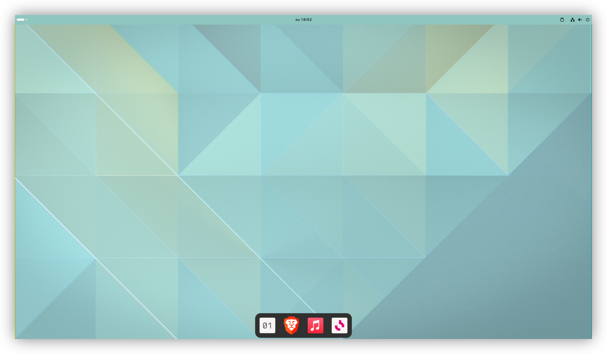
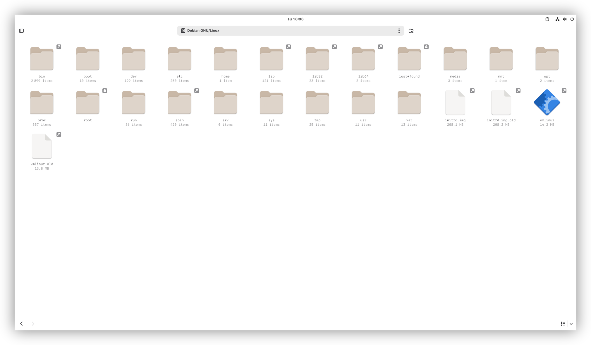
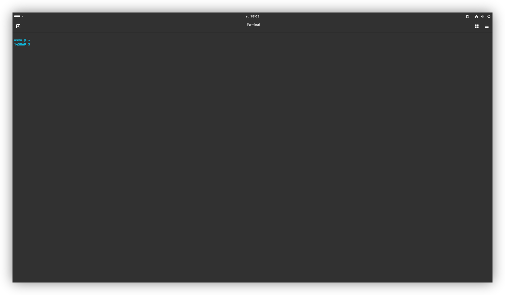
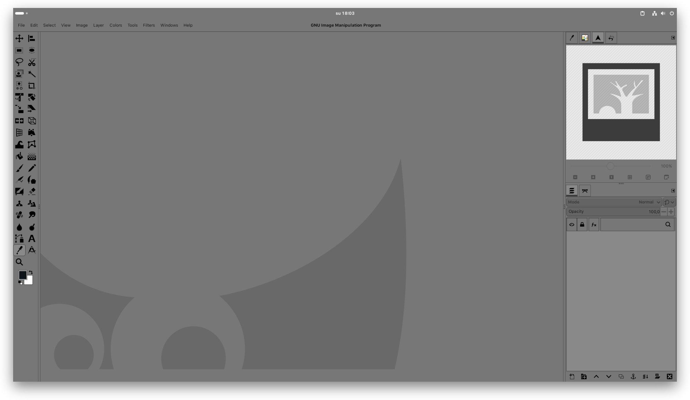
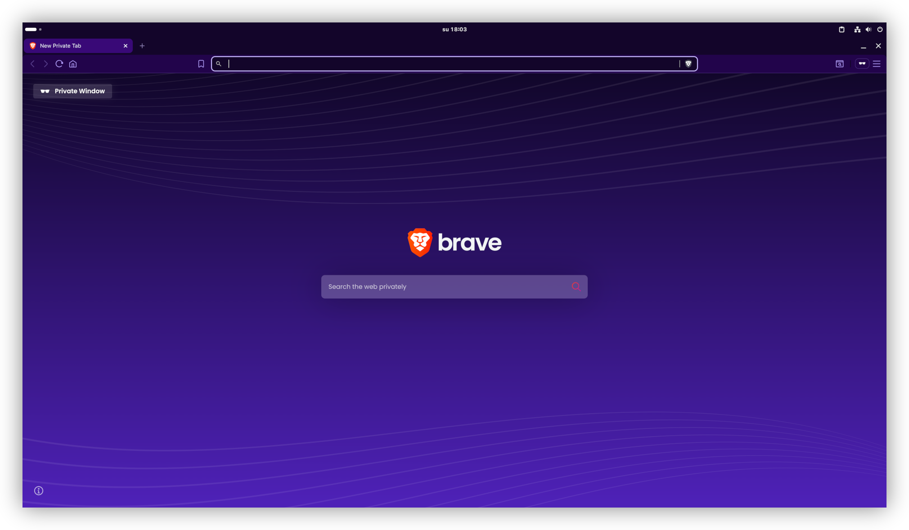

Panel Color Matcher GNOME Shell Extension
=========================================

Panel Color Matcher is a GNOME Shell extension to dynamically change the
top panel background color to match the wallpaper or the color of a
maximized window.

## Installing

Install to home directory.

```bash
make install
```

Activate in the GNOME Extensions app.

## Known Issues

This extension uses programmatic single-pixel screenshots to sample
colors right below the panel. This seems to be the only approach that
currently works, but has some problems.

* Dash to Dock seems to "tremble" when the color sampling is done, which
  is when the focus window changes or the focused window is resized.

* The color sampling uses more CPU than we'd like. It shouldn't be an
  issue on any modern multi-core system, but if you have a very
  low-power system, you might not want to use this.

## Screenshots

Color from wallpaper:


Light window maximized:


Dark window maximized:


Any color window maximized:


